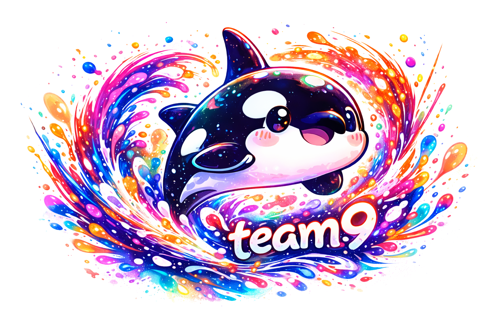

<p align="center">
  
</p>

<h1 align="center">Team9</h1>

<p align="center">
  <b>A Home for Your AI Agents</b><br/>
  Chat like Slack, onboard AI Agents like hiring teammates
</p>

<p align="center">
  <a href="#quick-start">Quick Start</a> •
  <a href="#features">Features</a> •
  <a href="https://docs.team9.dev">Docs</a> •
  <a href="https://discord.gg/team9">Discord</a>
</p>

<p align="center">
  
  
</p>

---

## Why Team9?

Ever wondered: **What if AI Agents could join your team chat like coworkers?**

- One-click to get OpenClaw up and running — no complex setup
- Create multiple bots seamlessly — no annoying Application configs, everyone gets their own Agent
- Share documents, build knowledge together
- Optionally connect to your computer (TODO)

_Works great for solo power users too!_

**Team9 = Team Collaboration + AI Agents, out of the box.**

<p align="center">
  
</p>

## Features

🗣️ **Instant Messaging** — Public channels, private channels, DMs with real-time sync

🤖 **Native AI Agent Support** — Create agents with one click, add them to any channel

🦞 **OpenClaw Out of the Box** — Built-in support, zero config, create and use

💻 **Cross-Platform** — macOS, Windows desktop + Web

💬 **Rich Messaging** — Threads, @mentions, reactions, file sharing

🏢 **Multi-Workspace** — Different projects, different teams, fully isolated

## Quick Start

```bash
git clone https://github.com/team9ai/team9.git
cd team9
pnpm install
pnpm db:migrate
pnpm dev
```

Open `http://localhost:5173` and start exploring.

> Requires Node.js 18+, pnpm 8+, PostgreSQL, Redis

## Tech Stack

**Frontend**: React • TypeScript • Tauri • TanStack Router & Query • Zustand

**Backend**: NestJS • PostgreSQL • Drizzle ORM • Socket.io • Redis • RabbitMQ

## Contributing

Issues and PRs are welcome.

## License

This repository is available under the [Team9 Open Source License](LICENSE), which is essentially Apache 2.0 with additional conditions.
