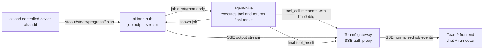

# aHand Job Output Stream Proxy Design

- **Date:** 2026-05-22
- **Status:** Draft (awaiting user review)
- **Scope:** Design only — stream long-running aHand job output into Team9 UI through the Team9 gateway.
- **Repos involved:** `team9ai/team9` · `team9ai/team9-agent-pi` · `team9ai/ahand`
- **Related specs:** `2026-04-22-ahand-integration-design.md`, `2026-05-01-tool-events-design.md`

---

## Summary

Team9 needs live visibility for long-running jobs, starting with `run_command`
on aHand devices but designed as a generic job monitor. The chosen direction is:

- aHand owns the execution output stream for aHand jobs.
- Team9 gateway exposes an authenticated SSE proxy to the Team9 frontend.
- The frontend subscribes only to Team9; aHand hub credentials are never exposed
  to browsers or Tauri webviews.
- agent-hive still owns tool execution semantics and final `tool_result`, but it
  must surface the aHand `hubJobId` early so Team9 can attach a monitor before
  the command finishes.
- aHand may implement its stream internally with its existing `OutputStream`,
  Redis Streams, TaskCast, or another backend. Team9 depends only on the stable
  aHand output-stream contract.

The UI should render the same job stream in both places users care about:

- the chat `run_command` tool block
- the routine/run detail page

---

## Goals

- Show stdout, stderr, progress, and terminal state while a long aHand job is
  still running.
- Support multiple subscribers for the same job: chat view, run detail, multiple
  clients, reconnects, and late joins.
- Preserve final tool result delivery through agent-hive.
- Avoid writing high-frequency log chunks into Team9's database.
- Keep TaskCast optional for this path. If aHand later uses TaskCast internally,
  Team9's gateway and frontend contract should not change.

## Non-Goals

- Do not route every stdout/stderr chunk through agent-hive.
- Do not expose aHand hub service tokens or control-plane tokens to the frontend.
- Do not replace Team9's existing TaskCast execution stream.
- Do not persist full command logs in Team9 DB in v1.
- Do not redesign the visual style of `ToolCallBlock`; this spec only adds a
  live data source and display states.

---

## Chosen Topology



Runtime flow:

1. agent-hive calls aHand through `@ahand/sdk` and starts a job.
2. aHand hub returns `hubJobId` as soon as the job is accepted.
3. agent-hive emits a Team9 tool update or metadata patch containing the
   `hubJobId`, `deviceId`, and provider information.
4. Team9 gateway records or derives a monitor mapping from Team9 execution/tool
   context to the aHand `hubJobId`.
5. Team9 frontend opens a Team9 SSE endpoint for that job.
6. Team9 gateway verifies user access, subscribes to aHand hub, normalizes the
   upstream stream, and forwards it to the frontend.
7. agent-hive eventually emits the final `tool_result` as it does today.

---

## aHand Contract

Team9 should depend on an output-stream-backed endpoint, not the current
active-only control stream if that stream cannot replay history.

Proposed endpoint:

```http
GET /api/control/jobs/{jobId}/output
Authorization: Bearer <control-plane or service token>
Accept: text/event-stream
Last-Event-ID: <last seen sequence, optional>
```

Required behavior:

- Multiple subscribers can read the same job concurrently.
- Late joiners can replay retained history.
- Reconnects can resume with `Last-Event-ID`.
- Events include monotonically increasing SSE `id` values.
- Terminal events are retained long enough for UI reloads and run detail views.
- If history has been trimmed, aHand emits an explicit resync event instead of
  silently continuing from an unsafe point.
- Slow subscribers do not break the job; they receive a lag/resync signal or are
  disconnected with a clear stream event.

Event names and normalized payloads:

```ts
type AHandJobOutputEvent =
  | {
      type: "stdout" | "stderr";
      jobId: string;
      chunk: string;
      seq: number;
      emittedAt: string;
    }
  | {
      type: "progress";
      jobId: string;
      seq: number;
      percent?: number;
      phase?: string;
      message?: string;
      emittedAt: string;
    }
  | {
      type: "finished";
      jobId: string;
      seq: number;
      exitCode: number;
      durationMs?: number;
      emittedAt: string;
    }
  | {
      type: "error";
      jobId: string;
      seq: number;
      code: string;
      message: string;
      emittedAt: string;
    }
  | {
      type: "resync";
      jobId: string;
      seq?: number;
      reason: "history_trimmed" | "subscriber_lagged" | "stream_reset";
      emittedAt: string;
    };
```

Implementation note:

- aHand already has an `OutputStream` path with history, sequence IDs,
  `Last-Event-ID`, multiple subscribers, and Redis-backed persistence. That is
  the correct Team9-facing source.
- If aHand internally chooses to back `OutputStream` with TaskCast, that remains
  an aHand implementation detail.

---

## Identity And Correlation

Team9 needs to separate its own UI/job identifiers from aHand hub identifiers.

Definitions:

- `executionId`: Team9 routine/task execution id.
- `toolCallId`: agent tool call id for the `run_command` invocation.
- `team9JobId`: Team9 monitor id used by the frontend.
- `hubJobId`: aHand hub job id.
- `deviceId`: aHand device id.
- `provider`: `"ahand"`.

Recommended tool metadata:

```ts
interface AHandJobMonitorMetadata {
  provider: "ahand";
  team9JobId: string;
  hubJobId: string;
  deviceId: string;
  executionId?: string;
  toolCallId: string;
  backend?: string;
  commandPreview?: string;
}
```

The metadata can be delivered by either:

- a `tool_delta` / `tool_call` update message, preferred for chat display, or
- routine execution metadata, acceptable for run detail if chat is not involved.

agent-hive must emit this mapping as soon as `hubJobId` is known. Waiting for
`spawn()` to resolve at command completion defeats live monitoring.

---

## Team9 Gateway

Proposed endpoint:

```http
GET /api/v1/agent-jobs/{team9JobId}/stream
Accept: text/event-stream
Last-Event-ID: <last seen sequence, optional>
```

Alternative route if implementation wants routine scoping in the path:

```http
GET /api/v1/routines/{routineId}/executions/{executionId}/jobs/{team9JobId}/stream
```

Gateway responsibilities:

- Authenticate the Team9 user.
- Verify the user can access the workspace/channel/execution owning the job.
- Resolve `team9JobId -> provider/hubJobId/deviceId`.
- Use a server-side aHand token to subscribe to the aHand output stream.
- Forward `Last-Event-ID` upstream.
- Normalize upstream events into Team9-facing job events.
- Close upstream subscriptions when the frontend disconnects.
- Never leak upstream authorization headers or service tokens.

Team9-facing event names:

| SSE event       | Meaning                                     |
| --------------- | ------------------------------------------- |
| `job.stdout`    | stdout chunk                                |
| `job.stderr`    | stderr chunk                                |
| `job.progress`  | progress update                             |
| `job.finished`  | terminal success/failure with an exit code  |
| `job.error`     | stream or job error                         |
| `job.resync`    | client should mark output as incomplete     |
| `job.keepalive` | optional heartbeat through idle connections |

Gateway should avoid semantic rewriting beyond normalization. For example,
`exitCode !== 0` remains a finished job with a non-zero exit code; agent-hive's
final `tool_result` still determines the final tool display semantics.

---

## Frontend

Add a lightweight job telemetry store keyed by `team9JobId`.

Responsibilities:

- Maintain output chunks, progress, terminal state, and resync state.
- Cap retained chunks in memory for chat cards; run detail can request a larger
  tail if needed.
- Reconnect with `Last-Event-ID`.
- Reuse the same store for the chat tool block and run detail page.
- Merge terminal stream state with final `tool_result` when it arrives.

UI behavior:

- A `run_command` card starts as soon as the tool call is visible.
- When monitor metadata arrives, the card subscribes to the Team9 job stream.
- stdout/stderr are shown live in the expanded tool output area.
- Compact chat rows show only status, backend/device, and a small tail summary.
- Run detail can show a fuller log panel and progress timeline.
- If a `job.resync` event arrives, the UI marks the log as incomplete and keeps
  rendering subsequent chunks.
- If the stream is unavailable but final `tool_result` arrives, the UI falls
  back to the final stdout/stderr display that exists today.

This keeps the live monitor additive: a stream outage should not break normal
agent execution or final result rendering.

---

## agent-hive Changes

agent-hive currently treats aHand `spawn()` as a blocking call that returns only
after the command finishes. For live monitoring it needs one additional signal:
the accepted aHand `hubJobId` must be observable immediately.

Required SDK/runtime changes:

- `@ahand/sdk` should expose `hubJobId` early, for example:
  - `onJobStarted({ jobId })`, or
  - a non-blocking `startJob()` returning `{ jobId, completion }`.
- `AHandHostComponent.spawn()` should emit Team9 job monitor metadata as soon as
  that callback fires.
- Existing stdout/stderr callback accumulation can remain for the final
  `tool_result`.
- `killProcess()` can later use `hubJobId` to call aHand cancel.

If stdout arrives before Team9 subscribes, aHand output history handles replay.
That is why the aHand stream contract must support late join and
`Last-Event-ID`.

---

## Failure Modes

| Failure                                       | Expected behavior                                              |
| --------------------------------------------- | -------------------------------------------------------------- |
| Frontend disconnects                          | Reconnect with `Last-Event-ID`                                 |
| aHand history trimmed                         | Forward `job.resync`; UI marks output incomplete               |
| aHand stream temporarily unavailable          | UI shows monitor unavailable; final result still works         |
| Team9 auth or access check fails              | Return 403/404 without revealing `hubJobId` details            |
| agent-hive never emits monitor metadata       | UI keeps current final-only behavior                           |
| aHand job finishes before frontend subscribes | Replay retained terminal/output events                         |
| Non-zero exit code                            | Stream emits `job.finished`; final tool result decides display |

---

## Security

- The frontend never talks directly to aHand hub.
- Team9 gateway performs all Team9 authorization checks before opening upstream
  streams.
- `hubJobId` should be treated as an internal reference, not sufficient for
  access by itself.
- Team9 should log monitor subscription attempts with user id, execution id,
  `team9JobId`, provider, and outcome.
- aHand stream tokens used by Team9 should be short-lived and scoped where
  possible to the target user/device/job.

---

## Testing Plan

aHand:

- Multiple subscribers receive the same live stdout/stderr events.
- Late subscriber receives retained history and terminal event.
- `Last-Event-ID` resumes without duplication.
- Trimmed history emits resync.
- Slow subscriber receives lag/resync behavior without affecting execution.

Team9 gateway:

- Authorized user can subscribe to a job stream.
- Unauthorized user receives 403 or 404.
- `Last-Event-ID` is forwarded upstream.
- Upstream stdout/stderr/progress/finished/error/resync map to Team9 events.
- Client disconnect closes the upstream subscription.
- aHand credentials are never included in response payloads or logs.

Frontend:

- `run_command` card shows live stdout/stderr before final result.
- Run detail and chat can subscribe to the same job without corrupting state.
- Reconnect resumes from the last event id.
- `job.resync` marks output incomplete.
- Missing stream metadata falls back to final-only rendering.

Integration:

- Mock aHand hub + Team9 gateway + agent-hive `run_command` path.
- Verify a command that prints multiple delayed lines appears incrementally in
  chat and run detail, then reconciles with final `tool_result`.

---

## Implementation Order

1. Stabilize the aHand output-stream endpoint and SDK early-job callback.
2. Add Team9 gateway job monitor mapping and SSE proxy.
3. Emit aHand monitor metadata from agent-hive when `hubJobId` is known.
4. Add frontend job telemetry store and SSE hook.
5. Wire `ToolCallBlock` and run detail to the shared telemetry store.
6. Add integration tests around delayed stdout/stderr and reconnect.

---

## Open Questions

- Should `team9JobId` be persisted in a small Team9 table, or derived from
  `executionId + toolCallId` and stored only in message metadata?
- What retention window should aHand use for finished job output: 10 minutes,
  1 hour, or tied to routine execution retention?
- Should the gateway route be generic from day one
  (`/api/v1/agent-jobs/{team9JobId}/stream`) or routine-scoped first?
- Should cancellation be included in v1 once `hubJobId` is available, or handled
  as a separate follow-up?
